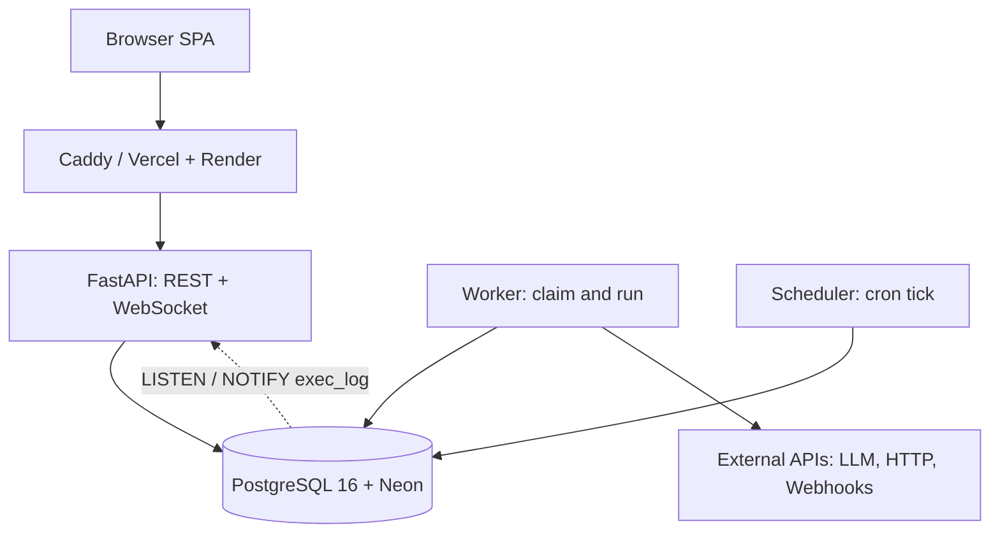
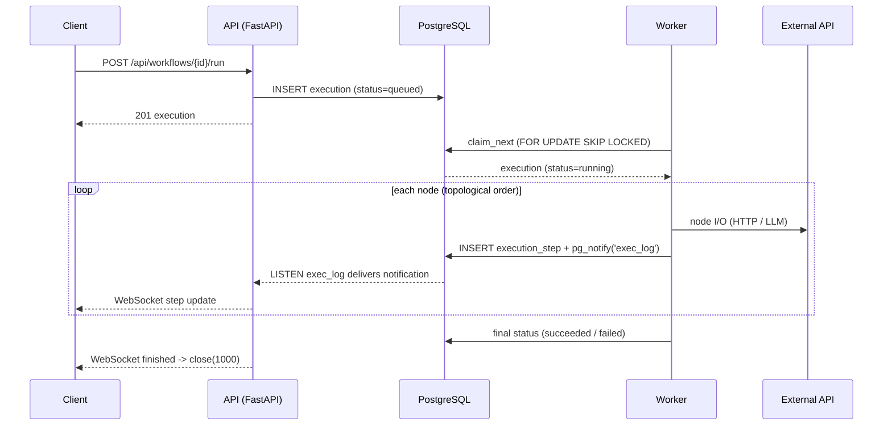

# Felagi Flow

> A self-hosted workflow automation platform with AI nodes: a FastAPI, async SQLAlchemy, and PostgreSQL backend with a React and TypeScript frontend.

[](https://www.python.org/)
[](https://fastapi.tiangolo.com/)
[](https://www.postgresql.org/)
[](https://www.sqlalchemy.org/)
[](https://react.dev/)
[](https://www.typescriptlang.org/)
[](https://vite.dev/)
[](https://tailwindcss.com/)
[](#testing)
[](#frontend-testing)
[](#testing)
[](https://felagi-flow.vercel.app)

## Live Demo

| Service | URL |
| --- | --- |
| **Frontend** | <https://felagi-flow.vercel.app> |
| **Backend API** | <https://felagi-flow-api.onrender.com> |
| **Swagger UI** | <https://felagi-flow-api.onrender.com/docs> |
| **Health check** | <https://felagi-flow-api.onrender.com/healthz> |

> **Note:** the backend runs on Render's free tier. A keep-alive ping ([cron-job.org](https://cron-job.org/)) hits `/healthz` every 5 minutes to keep it warm, but the first request after a long idle period can still take 30-60 seconds. Database is [Neon](https://neon.tech/) serverless PostgreSQL.

## Features

- **Visual workflow editor**: a drag-and-drop graph canvas built on [React Flow](https://reactflow.dev/), with 8 node types.
- **Triggers**: manual, cron schedule, and public webhook.
- **Actions**: HTTP Request, LLM (OpenAI-compatible), Set, If, and Debug.
- **PostgreSQL-backed queue**: `executions` is both the journal and the work queue, claimed with `FOR UPDATE SKIP LOCKED`, ownership extended by heartbeats, and stale locks reclaimed.
- **Per-node retry**: `max_retries` with fixed or exponential backoff.
- **Live logs via WebSocket**: `LISTEN/NOTIFY` fan-out pushes each step to the browser as it completes.
- **Multi-tenancy**: workspaces with `owner`/`admin`/`member` roles and email invitations.
- **Versioning**: save a draft version, publish it, and browse version history.
- **JWT auth**: short-lived access token in memory plus a rotating refresh token in an httpOnly cookie.
- **Run history** with status filters and keyset pagination.
- Tested on both sides: 258 backend tests and 57 frontend tests, 315 in total.

## Architecture



The backend is split by process role: the **API** serves REST and WebSocket traffic, the **worker** claims and executes runs from the queue, and the **scheduler** enqueues runs from cron schedules. All three share one PostgreSQL database and coordinate through it. There is no separate message broker.

## Request Flow

A manual run from a published workflow:



## Tech Stack

| Area | Technology |
| --- | --- |
| Language | [Python 3.13](https://www.python.org/) |
| API | [FastAPI](https://fastapi.tiangolo.com/) |
| Validation | [Pydantic v2](https://docs.pydantic.dev/) and [pydantic-settings](https://docs.pydantic.dev/latest/concepts/pydantic_settings/) |
| ORM | [SQLAlchemy 2.0](https://www.sqlalchemy.org/) async |
| Database | [PostgreSQL 16](https://www.postgresql.org/) with [asyncpg](https://magicstack.github.io/asyncpg/) |
| Migrations | [Alembic](https://alembic.sqlalchemy.org/) |
| Auth | [PyJWT](https://pyjwt.readthedocs.io/) and [argon2-cffi](https://argon2-cffi.readthedocs.io/) |
| Queue | PostgreSQL (`FOR UPDATE SKIP LOCKED`, heartbeats, reclaim) |
| Scheduling | [croniter](https://github.com/kiorky/croniter) + cluster-wide advisory lock |
| LLM | [openai](https://github.com/openai/openai-python) SDK (custom `base_url`) |
| Logging | [structlog](https://www.structlog.org/) |
| Testing | [pytest](https://docs.pytest.org/), [pytest-asyncio](https://pytest-asyncio.readthedocs.io/), [httpx](https://www.python-httpx.org/) |
| Tooling | [Ruff](https://docs.astral.sh/ruff/), [mypy](https://www.mypy-lang.org/) |
| Local infrastructure | [Docker](https://www.docker.com/) and Docker Compose |
| Hosting (frontend) | [Vercel](https://vercel.com/): <https://felagi-flow.vercel.app> |
| Hosting (backend) | [Render](https://render.com/): <https://felagi-flow-api.onrender.com> |
| Database (production) | [Neon](https://neon.tech/) serverless PostgreSQL |
| Keep-alive | [cron-job.org](https://cron-job.org/) pings `/healthz` every 5 minutes |

## Frontend

A single-page application that consumes the API: sign in, browse workspaces, edit workflows on a graph canvas, and watch runs execute live.

### Frontend stack

| Area | Technology |
| --- | --- |
| Language | [TypeScript 5.9](https://www.typescriptlang.org/) (strict, no `any`) |
| UI library | [React 19](https://react.dev/) |
| Build tool | [Vite 7](https://vite.dev/) |
| Styling | [Tailwind CSS 4](https://tailwindcss.com/) |
| Graph editor | [React Flow 12](https://reactflow.dev/) (`@xyflow/react`) |
| Routing | [React Router 7](https://reactrouter.com/) |
| Server state | [TanStack Query 5](https://tanstack.com/query) |
| Client state | [Zustand 5](https://zustand.docs.pmnd.rs/) |
| Components | [Radix UI](https://www.radix-ui.com/) primitives with `cva` variants |
| Icons | [lucide-react](https://lucide.dev/) |
| Realtime | Browser WebSocket for live execution logs (with polling fallback) |
| Testing | [Vitest 4](https://vitest.dev/) (jsdom) and [Playwright](https://playwright.dev/) for E2E |

### Screens

> Screenshots are not committed yet. Drop them into [`docs/screenshots/`](docs/screenshots) and they will render below. **TODO.**

| Workflow editor | Live execution logs |
| --- | --- |
|  |  |

### Frontend commands

```text
npm run dev         # development server
npm run build       # type-check and production build
npm run preview     # serve the production build
npm run typecheck   # tsc --noEmit
npm run test        # vitest run
```

## Project Structure

```text
backend/
├── app/
│   ├── api/
│   │   ├── routes/          # auth, workspaces, invitations, workflows,
│   │   │                    # executions, hooks, schedules, ws, node types
│   │   └── ws_manager.py    # LISTEN/NOTIFY manager for live logs
│   ├── engine/
│   │   ├── runner.py        # topological execution of a workflow graph
│   │   ├── queue.py         # claim / heartbeat / reclaim / complete
│   │   ├── notify.py        # pg_notify helper for the exec_log channel
│   │   ├── graph_validator.py
│   │   ├── node_schemas.py  # node catalog: metadata + param JSON-Schema
│   │   ├── cron.py
│   │   └── nodes/           # one handler per node type
│   ├── worker/              # queue claim loop (python -m app.worker)
│   ├── scheduler/           # cron tick (python -m app.scheduler)
│   ├── shared/              # models, schemas, config, security, db, logging
│   └── main.py              # FastAPI app + lifespan (LISTEN)
├── alembic/versions/        # schema migrations
└── tests/

frontend/
├── src/
│   ├── api/                 # REST clients + WebSocket wrapper
│   ├── editor/              # React Flow canvas, palette, params panel, toolbar
│   ├── hooks/               # useExecutionLogs (WS + polling fallback)
│   ├── pages/               # workspace list, workflow list, editor, executions
│   ├── stores/              # zustand (auth, editor)
│   ├── types/               # types mirroring the backend schemas
│   └── lib/                 # shared helpers
└── e2e/                     # Playwright smoke test

docs/                        # architecture, api, development, deploy
docker/                      # Postgres init scripts
```

## Quick Start

### Docker (local)

1. Copy the example environment file and set local secrets:

   ```text
   cp .env.example .env
   ```

2. Start the stack:

   ```text
   docker compose up -d --build
   ```

3. Check that the API is healthy:

   ```text
   curl http://localhost/healthz
   ```

   Expected response:

   ```json
   {"status":"ok"}
   ```

4. Open <http://localhost>.

### Production deploy

The stack is deployed as Vercel (frontend) + Render (API) + Neon (PostgreSQL). See [`docs/deploy.md`](docs/deploy.md) for the full walkthrough.

## API Endpoints

### System

| Method | Endpoint | Description | Authentication |
| --- | --- | --- | --- |
| `GET` | `/healthz` | Liveness check | No |

### Authentication

| Method | Endpoint | Description | Authentication |
| --- | --- | --- | --- |
| `POST` | `/api/auth/register` | Register a user; creates a workspace | No |
| `POST` | `/api/auth/login` | Get an access token (refresh cookie set) | No |
| `POST` | `/api/auth/refresh` | Rotate tokens from the refresh cookie | Refresh cookie |
| `POST` | `/api/auth/logout` | Clear the refresh cookie | No |
| `GET` | `/api/auth/me` | Get the current user | Bearer access token |

### Workspaces

| Method | Endpoint | Description | Authentication |
| --- | --- | --- | --- |
| `GET` | `/api/workspaces` | List workspaces the user belongs to | Bearer |
| `GET` | `/api/workspaces/{ws_id}` | Get a workspace | Member+ |
| `PATCH` | `/api/workspaces/{ws_id}` | Rename a workspace | Owner/admin |
| `DELETE` | `/api/workspaces/{ws_id}` | Delete a workspace | Owner |
| `GET` | `/api/workspaces/{ws_id}/members` | List members | Member+ |
| `PATCH` | `/api/workspaces/{ws_id}/members/{user_id}` | Change a member role | Owner |
| `DELETE` | `/api/workspaces/{ws_id}/members/{user_id}` | Remove a member | Owner/admin |

### Invitations

| Method | Endpoint | Description | Authentication |
| --- | --- | --- | --- |
| `POST` | `/api/workspaces/{ws_id}/invitations` | Invite by email | Owner/admin |
| `GET` | `/api/workspaces/{ws_id}/invitations` | List invitations | Owner/admin |
| `DELETE` | `/api/workspaces/{ws_id}/invitations/{id}` | Revoke an invitation | Owner/admin |
| `POST` | `/api/invitations/{token}/accept` | Accept an invitation | Bearer |

### Workflows, versions and runs

| Method | Endpoint | Description | Authentication |
| --- | --- | --- | --- |
| `POST` | `/api/workspaces/{ws_id}/workflows` | Create a workflow | Member+ |
| `GET` | `/api/workspaces/{ws_id}/workflows` | List workflows | Member+ |
| `GET` | `/api/workflows/{id}` | Get a workflow | Member+ |
| `PATCH` | `/api/workflows/{id}` | Update workflow metadata | Owner/admin |
| `DELETE` | `/api/workflows/{id}` | Delete a workflow | Owner/admin |
| `POST` | `/api/workflows/{id}/versions` | Save a draft version (validated) | Member+ |
| `GET` | `/api/workflows/{id}/versions` | List versions | Member+ |
| `GET` | `/api/workflows/{id}/versions/{version}` | Get a specific version | Member+ |
| `POST` | `/api/workflows/{id}/publish` | Publish a version | Owner/admin |
| `POST` | `/api/workflows/{id}/run` | Trigger a manual run | Member+ |

### Executions

| Method | Endpoint | Description | Authentication |
| --- | --- | --- | --- |
| `GET` | `/api/executions/{id}` | Run details with all steps | Member+ |
| `GET` | `/api/workspaces/{ws_id}/executions` | List/filter runs (keyset pagination) | Member+ |
| `POST` | `/api/executions/{id}/cancel` | Cancel a running execution | Member+ |

### Node types, schedules and webhooks

| Method | Endpoint | Description | Authentication |
| --- | --- | --- | --- |
| `GET` | `/api/node-types` | Node catalog + param JSON-Schema | Bearer |
| `GET` | `/api/workspaces/{ws_id}/schedules` | List cron schedules | Member+ |
| `POST` | `/hooks/{token}` | Public webhook intake | No (secret token) |
| `GET` | `/ws/executions/{id}` | Live logs (WebSocket, token in query) | Access token in query |

Interactive API docs are served at `/docs` (Swagger UI) and `/redoc`.

## Auth & Authorization

### JWT tokens

| Token | Default TTL | Storage |
| --- | --- | --- |
| Access | 15 minutes (`ACCESS_TOKEN_EXPIRE_MINUTES`) | In memory (client state) |
| Refresh | 30 days (`REFRESH_TOKEN_EXPIRE_DAYS`) | httpOnly cookie (`/api/auth` path) |

Access tokens are signed JWTs sent as `Authorization: Bearer <token>`. Refresh tokens live in an httpOnly, `SameSite`-configurable cookie and are rotated on each refresh. Passwords are hashed with Argon2.

### Roles

| Role | Workspace | Members | Invitations | Workflows |
| --- | --- | --- | --- | --- |
| `owner` | Update, delete | Change roles, remove | Create, revoke | Full CRUD, publish |
| `admin` | Update | Remove (non-owner) | Create, revoke | Full CRUD, publish |
| `member` | Read | Read | - | Create, edit, run |

### Multi-tenant isolation

Every resource is scoped to a workspace. Endpoints first resolve the object, then verify the caller's membership in its workspace. A non-member receives `403`, a missing object `404`. Public webhooks are the one exception: access is by a secret route token instead of JWT.

## Testing

```text
cd backend
uv run python -m pytest tests/ -q
```

| Suite | Coverage |
| --- | --- |
| Unit | Graph validator, expressions, retry/backoff, cron helpers |
| Integration | Auth, workspaces, invitations, workflows, executions, queue, triggers, WebSocket live logs, tenant isolation |

Some tests are marked `@pytest.mark.postgres` (they need real `SKIP LOCKED`, `LISTEN/NOTIFY`, and advisory locks) and are skipped without `TEST_DATABASE_URL`. The backend suite has **258 passing tests**.

The frontend adds **57 passing tests** (see [Frontend testing](#frontend-testing)), bringing the total to **315 tests**.

Additional quality checks:

```text
cd backend
uv run python -m ruff check .
uv run python -m mypy .
```

For the frontend:

```text
cd frontend
npx tsc --noEmit
npx vitest run
```

<a id="frontend-testing"></a>

### Frontend testing

```text
cd frontend
npx vitest run
```

| Suite | Coverage |
| --- | --- |
| API client | Request URLs, methods, and query parameters |
| Hook `useExecutionLogs` | WebSocket snapshot/steps/finished, reconnection to fallback, metadata refresh after finish |
| Realtime URL | `ws://` vs `wss://` derivation from `VITE_API_URL` |
| Stores | Editor state transitions |
| Utilities | Date/time and formatting helpers |

The frontend suite has **57 passing tests** across 6 files.

## Design Decisions

### PostgreSQL as the queue (no broker)

`executions` doubles as the journal and the work queue. Workers claim with `FOR UPDATE SKIP LOCKED`, so N workers pull distinct jobs without blocking; ownership is extended by heartbeats and stale locks are reclaimed. One database, no extra moving parts.

### `NOTIFY` before `COMMIT`, not after

Postgres delivers `NOTIFY` only at commit and coalesces identical payloads within a single transaction. Since our payload *is* the `execution_id`, sending `pg_notify` after commit would collapse the run's step notifications into one delivery. It is emitted inside the step transaction, right before commit.

### A `sequence` column on `execution_steps`

`created_at` reflects transaction time, which is identical for steps committed in the same batch. A monotonic `sequence` (seeded from `MAX(sequence)` on rerun) gives stable ordering that REST and WebSocket share.

### JWT access in memory + refresh in an httpOnly cookie

The access token never touches `localStorage`, so XSS cannot easily exfiltrate it; the refresh token is httpOnly and scoped to the auth path. Refresh rotates the cookie on each use.

### LLM through the OpenAI SDK with a custom `base_url`

The LLM node speaks the OpenAI-compatible protocol against a configurable `LLM_BASE_URL`, so it is not tied to a single provider. An optional `LLM_MODELS` allowlist validates the requested model.

### Fernet for credentials

Sensitive per-workspace values are encrypted at rest with `cryptography`'s Fernet (symmetric AEAD), keyed by `FERNET_KEY`.

## Roadmap

- [x] Stage 1: Skeleton (FastAPI, React, Docker, CI)
- [x] Stage 2: Auth + multi-tenancy
- [x] Stage 3: Workflows + visual editor
- [x] Stage 4: Execution engine + retry
- [x] Stage 5: Cron + webhook + WebSocket live logs
- [x] Stage 6: LLM node (OpenAI-compatible API)
- [x] Stage 7: Deploy (Vercel + Render + Neon)
- [ ] Stage 8: OAuth + Gmail/Notion/Sheets/Discord nodes
- [ ] Stage 9: Dead-letter queue + replay
- [ ] Stage 10: Billing + RLS

## Environment Variables

| Variable | Required | Default | Description |
| --- | --- | --- | --- |
| `DATABASE_URL` | Yes | - | Async PostgreSQL URL (`postgresql+asyncpg://...`) |
| `JWT_SECRET_KEY` | Yes | - | JWT signing key; use at least 32 characters |
| `FERNET_KEY` | Yes | - | Fernet key for encrypting stored credentials |
| `LLM_API_KEY` | No | - | API key for the OpenAI-compatible LLM endpoint |
| `LLM_BASE_URL` | No | `http://185.221.214.224:4100/v1` | Base URL of the LLM endpoint |
| `LLM_MODELS` | No | `[]` | JSON array of allowed models; empty allows any |
| `FRONTEND_URL` | No | `http://localhost` | Base URL for invite links |
| `CORS_ORIGINS` | No | `[]` | JSON array of allowed frontend origins |
| `COOKIE_SECURE` | No | `false` | Set `true` behind HTTPS (required for `COOKIE_SAMESITE=none`) |
| `COOKIE_SAMESITE` | No | `lax` | `lax` for same-site, `none` for cross-site (Vercel to Render) |
| `DB_SSL_REQUIRE` | No | `false` | Force TLS to Postgres; auto-enabled for `*.neon.tech` |
| `LOG_LEVEL` | No | `INFO` | Application log level |
| `ACCESS_TOKEN_EXPIRE_MINUTES` | No | `15` | Access token lifetime |
| `REFRESH_TOKEN_EXPIRE_DAYS` | No | `30` | Refresh token lifetime |
| `POSTGRES_*` | No | - | `USER`/`PASSWORD`/`DB`/`PORT` for the local Docker database |

The LLM node degrades gracefully: without `LLM_API_KEY` it returns a step error, and the rest of the platform keeps working.

## License

Distributed under the MIT License.

## Author

[FELAGI0](https://github.com/FELAGI0)

---

Made with Python, FastAPI, React, and PostgreSQL